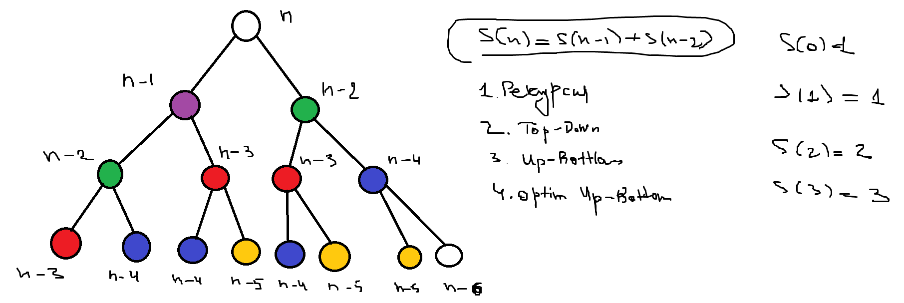

# Dynamic Programming


**Динамическое программирование** (Dynamic Programming, DP) — это метод оптимизации, применяемый для решения сложных задач путем разбиения их на перекрывающиеся подзадачи и использования уже найденных решений для их повторного использования.

## Основные идеи
1. Оптимальная структура подзадач — решение задачи можно выразить через решения её подзадач.
2. Перекрывающиеся подзадачи — одни и те же подзадачи возникают многократно.
3. Запоминание (Memoization) или табличный метод (Tabulation) — результаты вычислений сохраняются, чтобы избежать повторных расчётов.

## Способы реализации
1. Top-Down (с мемоизацией) — рекурсивный подход с кэшированием уже вычисленных значений.
2. Bottom-Up (с табличным заполнением) — итеративный подход, где мы заполняем таблицу от базового случая к общему.

## Примеры задач:
- Числа Фибоначчи.
- Задача о рюкзаке (0/1 Knapsack).
- Наибольшая возрастающая подпоследовательность (LIS).
- Задача о размене монет (Coin Change).
- Задача о наибольшем общем подпоследовательности (LCS).

---

## Подходы к решению

0. Расписать дерево вызовов — получить формулу расчета.
1. Реализация решения через рекурсию. По времен: `O(2^n)`, по памяти: `O(n)`
2. Вдереве вызовов найти общие точки и перекрыть их кэшем. Таким образом рекурсия остается, но промежуточные ответы используются повторно.
Это подход: Top-Down. По времен: `O(n)`, по памяти: `O(n)`.
3. Определить базовые случаи. Если есть возможность двигаться от базовых случаев к ответу, то реализуем Bottom-Up. Заполняем таблицу промежуточных результатов.
По времен: `O(n)`, по памяти: `O(n)`. Отличие от п. 2 — нет рекурсии, используются итерации.
4. Попытаться избавиться от хранения лишних промежуточных результатов. Оптимизированный подход Bottom-Up. По времен: `O(n)`, по памяти: `O(m) (m <= n)`.


## Подходы к решению задачи

### 0. Расписание дерева вызовов
- Для начала можно **расписать дерево рекурсивных вызовов**, чтобы понять структуру задачи и увидеть повторяющиеся вычисления.
- Это позволяет получить **рекуррентную формулу** (например, для чисел Фибоначчи:  
  ```go
  F(n) = F(n-1) + F(n-2)
  ```
  с базовыми случаями  `F(0) = 0`, `F(1) = 1`.

### 1. Наивная рекурсия
- **Принцип:** Используем обычную рекурсию, вызывая функцию для подзадач, пока не дойдем до базовых случаев.
- **Сложность:**
  - **Время:** `O(2^n)` (из-за повторяющихся вычислений для одинаковых подзадач).
  - **Память:** `O(n)` (глубина стека вызовов рекурсии).
- **Проблема:** Множество одинаковых вычислений для одинаковых подзадач, что приводит к экспоненциальной сложности.

### 2. Top-Down (рекурсия с мемоизацией)
- **Принцип:** Сохраняем уже вычисленные результаты в кэше (например, в массиве или хеш-таблице), чтобы избежать повторных вычислений.
- **Сложность:**
  - **Время:** `O(n)` (каждое значение вычисляется только один раз).
  - **Память:** `O(n)` (для хранения кэша и глубины стека рекурсии).
- **Преимущества:** Рекурсивный подход сохраняется, но теперь результаты подзадач используются повторно, что значительно улучшает производительность.

### 3. Bottom-Up (итеративный подход)
- **Принцип:** Начинаем с базовых случаев и постепенно строим решение вверх, заполняя таблицу промежуточных результатов.
- **Сложность:**
  - **Время:** `O(n)` (линейный цикл для заполнения таблицы).
  - **Память:** `O(n)` (используется таблица для хранения промежуточных результатов).
- **Преимущества:** Нет рекурсии, задача решается итеративно, что уменьшает затраты на стек вызовов.

### 4. Оптимизированный Bottom-Up
- **Принцип:** Используем тот же принцип, что и в Bottom-Up, но избавляемся от хранения всех промежуточных результатов, храня только два последних значения.
- **Сложность:**
  - **Время:** `O(n)` (по-прежнему линейное время на расчет).
  - **Память:** `O(1)` (используются только несколько переменных для хранения последних значений).
- **Преимущества:** Наименьшие затраты памяти при сохранении эффективности по времени.

---

### Резюме

| Подход                | Время       | Память     | Особенности |
|-----------------------|-------------|------------|-------------|
| Наивная рекурсия      | `O(2^n)`  | `O(n)`   | Много повторных вызовов |
| Top-Down (мемоизация) | `O(n)`    | `O(n)`   | Запоминаем результаты для использования повторно |
| Bottom-Up (таблица)   | `O(n)`    | `O(n)`   | Итеративный подход, требует массива |
| Оптимизированный Bottom-Up | `O(n)`  | `O(1)`   | Самый эффективный по памяти |

---

### Рекомендации
- Для простых задач **Bottom-Up с оптимизацией** — лучший выбор (`O(n)` по времени и `O(1)` по памяти).
- **Top-Down** — удобен для сложных рекурсивных задач, где важно запоминание промежуточных результатов.
- **Наивная рекурсия** — неэффективный метод, лучше избегать в реальных задачах.


### 509. Fibonacci Number

#### Вариант 1. Рекурсия
                                   F(n)    
                        /                           \ 
                  F(n-1)                            F(n-2) 
            /               \                   /             \   
        F(n-2)             F(n-3)           F(n-3)          F(n-4)
        /    \             /   \            /   \           /    \ 
    F(n-3)   F(n-4)   F(n-4)   F(n-5)   F(n-4) F(n-5)    F(n-5)  F(n-6)
    /    \   /    \    /    \  /    \   /    \ /    \    /    \  /    \

```go
func fib(n int) int {
    if n == 0 {
        return 0
    }
    if n == 1 {
        return 1
    }
    return fib(n-1) + fib(n-2)
}
```

#### Сложность:  
Временная сложность:
Алгоритм использует рекурсию с двумя вызовами на каждом уровне.
Глубина рекурсии — **O(n)**, а количество вызовов экспоненциально (каждый вызов порождает два новых).

Пространственная сложность:
Функция не использует дополнительную память, но рекурсия создает стек вызовов глубиной **O(n)**.

### Сложность:  
- **Время:** `O(2^n)` — экспоненциальный рост вызовов.  
- **Память:** `O(n)` — из-за глубины рекурсии

#### Вариант 2. Top-Down (с мемоизацией) **рекурсия + мемоизация**

                                            Top-Down
                          F(n)                  |
                        /     \                 |
                    F(n-1)   F(n-2)             |
                    /   \    /   \              |
              F(n-2)    F(n-3)    F(n-4)        |
             /    \     /   \     /   \         |
         F(n-3)   F(n-4)    F(n-5)    F(n-6)    |
         /    \   /    \    /    \    /    \    v

Так как есть пересекающиеся участки — есть смысл использовать кэш.

```go
func fib(n int) int {
    cache := make(map[int]int)

    var topDown func(int) int
    
    topDown = func (i int) int {
        if i == 0 {
            return 0
        }
        if i == 1 {
            return 1
        }
        if v, ok := cache[i]; ok {
            return v
        } else {
            cache[i] = topDown(i-1)+topDown(i-2)
            return cache[i]
        }
    }

    return topDown(n)
}
```
### Сложность:  
- **Время:** `O(n)` — каждое значение вычисляется только один раз и кэшируется.  
- **Память:** `O(n)` — из-за хранения кэша и глубины рекурсии

#### Вариант 3. Bottom-Up (с табличным заполнением) **итерация + табличное хранение**

F(0) -> F(1) -> F(2) -> F(3) -> F(4) -> F(5) -> ...

```go
func fib(n int) int {
    if n == 0 {
        return 0
    }
    if n == 1 {
        return 1
    }
    
    dp := make([]int, n+1) // Создаем массив для хранения значений
    dp[0], dp[1] = 0, 1    // Базовые случаи

    for i := 2; i <= n; i++ {
        dp[i] = dp[i-1] + dp[i-2] // Вычисляем значение и сохраняем его
    }
    
    return dp[n] // Возвращаем результат
}
```
### Сложность:  
- **Время:** `O(n)` — каждое значение в таблице вычисляется только один раз.  
- **Память:** `O(n)` — из-за хранения таблицы


#### Вариант 4. Bottom-Up (с частичным хранением)
**!оптимальное решение!**
Если внимательно посмотреть, нам не нужен весь массив `dp[]`, потому что для вычисления `fib(n)` нужны только два последних значения (`fib(n-1)` и `fib(n-2)`).

```go
func fib(n int) int {
    if n == 0 {
        return 0
    }
    if n == 1 {
        return 1
    }
    
    prev2, prev1 := 0, 1 // Запоминаем только два последних числа
    for i := 2; i <= n; i++ {
        curr := prev1 + prev2
        prev2, prev1 = prev1, curr // Обновляем значения
    }
    
    return prev1
}
```

### Сложность:  
- **Время:** `O(n)` — каждое значение в таблице вычисляется только один раз.  
- **Память:** `O(1)` — храним только два прошлых значения

---

### 70. Climbing Stairs



#### Вариант 1. Рекурсия
                                   S(n)    
                        /                           \ 
                  S(n-1)                            S(n-2) 
            /               \                   /             \   
        S(n-2)             F(n-3)           S(n-3)          S(n-4)
        /    \             /   \            /   \           /    \ 
    S(n-3)   S(n-4)   S(n-4)   S(n-5)   S(n-4) S(n-5)    S(n-5)  S(n-6)
    /    \   /    \    /    \  /    \   /    \ /    \    /    \  /    \

```go
func climbStairs(n int) int {
    if n == 0 {
        return 1
    }
    if n == 1 {
        return 1
    }
    return climbStairs(n-1) +  climbStairs(n-2)
}
```

#### Сложность:  
Временная сложность:
Алгоритм использует рекурсию с двумя вызовами на каждом уровне.
Глубина рекурсии — **O(n)**, а количество вызовов экспоненциально (каждый вызов порождает два новых).

Пространственная сложность:
Функция не использует дополнительную память, но рекурсия создает стек вызовов глубиной **O(n)**.

### Сложность:  
- **Время:** `O(2^n)` — экспоненциальный рост вызовов.  
- **Память:** `O(n)` — из-за глубины рекурсии

#### Вариант 2. Top-Down (с мемоизацией) **рекурсия + мемоизация**

                                            Top-Down
                          S(n)                  |
                        /     \                 |
                    S(n-1)   S(n-2)             |
                    /   \    /   \              |
              S(n-2)    S(n-3)    S(n-4)        |
             /    \     /   \     /   \         |
         S(n-3)   S(n-4)    S(n-5)    S(n-6)    |
         /    \   /    \    /    \    /    \    v

Так как есть пересекающиеся участки — есть смысл использовать кэш.

```go
func climbStairs(n int) int {
    cache := make(map[int]int, n+1)
    cache[0] = 1
    cache[1] = 1

    var varSteps func (int) int

    varSteps = func (i int) int {
        if v, ok := cache[i]; ok {
            return v
        } else {
            cache[i] = varSteps(i-1) + varSteps(i-2)
            return cache[i]
        }
    }
    return varSteps(n)
}
```
### Сложность:  
- **Время:** `O(n)` — каждое значение вычисляется только один раз и кэшируется.  
- **Память:** `O(n)` — из-за хранения кэша и глубины рекурсии

#### Вариант 3. Bottom-Up (с табличным заполнением) **итерация + табличное хранение**

S(0) -> S(1) -> S(2) -> S(3) -> S(4) -> S(5) -> ...

```go
func climbStairs(n int) int {
    dp := make([]int, n+1)
    dp[0] = 1
    dp[1] = 1

    for i:=2; i<=n; i++ {
       dp[i] = dp[i-1] + dp[i-2]
    }

    return dp[n]
}
```
### Сложность:  
- **Время:** `O(n)` — каждое значение в таблице вычисляется только один раз.  
- **Память:** `O(n)` — из-за хранения таблицы


#### Вариант 4. Bottom-Up (с частичным хранением)
**!оптимальное решение!**
Если внимательно посмотреть, нам не нужен весь массив `dp[]`, потому что для вычисления `S(n)` нужны только два последних значения (`S(n-1)` и `S(n-2)`).

```go
func climbStairs(n int) int {
    a, b := 1, 1

    for i:=2; i<=n; i++ {
        curr := a + b
        a, b = b, curr
    }

    return b
}
```

### Сложность:  
- **Время:** `O(n)` — каждое значение в таблице вычисляется только один раз.  
- **Память:** `O(1)` — храним только два прошлых значения

---

### 746. Min Cost Climbing Stairs


#### Вариант 1. Рекурсия
                                   S(n)    
                        /                           \ 
                  S(n-1)                            S(n-2) 
            /               \                   /             \   
        S(n-2)             F(n-3)           S(n-3)          S(n-4)
        /    \             /   \            /   \           /    \ 
    S(n-3)   S(n-4)   S(n-4)   S(n-5)   S(n-4) S(n-5)    S(n-5)  S(n-6)
    /    \   /    \    /    \  /    \   /    \ /    \    /    \  /    \

```go
func minCostClimbingStairs(cost []int) int {
    var costSteps func (int) int

    costSteps = func (lvl int) int {
        if lvl == 0 {
            return cost[0]
        }
        if lvl == 1 {
            return cost[1]
        }
        return cost[lvl] + min(costSteps(lvl-1), costSteps(lvl-2))
    }
    return min(costSteps(len(cost)-1), costSteps(len(cost)-2))
}
```

#### Сложность:  
Временная сложность:
Алгоритм использует рекурсию с двумя вызовами на каждом уровне.
Глубина рекурсии — **O(n)**, а количество вызовов экспоненциально (каждый вызов порождает два новых).

Пространственная сложность:
Функция не использует дополнительную память, но рекурсия создает стек вызовов глубиной **O(n)**.

### Сложность:  
- **Время:** `O(2^n)` — экспоненциальный рост вызовов.  
- **Память:** `O(n)` — из-за глубины рекурсии

#### Вариант 2. Top-Down (с мемоизацией) **рекурсия + мемоизация**

                                            Top-Down
                          S(n)                  |
                        /     \                 |
                    S(n-1)   S(n-2)             |
                    /   \    /   \              |
              S(n-2)    S(n-3)    S(n-4)        |
             /    \     /   \     /   \         |
         S(n-3)   S(n-4)    S(n-5)    S(n-6)    |
         /    \   /    \    /    \    /    \    v

Так как есть пересекающиеся участки — есть смысл использовать кэш.

```go
func minCostClimbingStairs(cost []int) int {

    cache := make(map[int]int, len(cost))
    cache[0] = cost[0]
    cache[1] = cost[1]

    var costSteps func (int) int

    costSteps = func (lvl int) int {
        if v, ok := cache[lvl]; ok {
            return v
        } else {
            cache[lvl] = cost[lvl] + min(costSteps(lvl-1), costSteps(lvl-2))
            return cache[lvl]
        }
    }
    return min(costSteps(len(cost)-1), costSteps(len(cost)-2))
}
```
### Сложность:  
- **Время:** `O(n)` — каждое значение вычисляется только один раз и кэшируется.  
- **Память:** `O(n)` — из-за хранения кэша и глубины рекурсии

#### Вариант 3. Bottom-Up (с табличным заполнением) **итерация + табличное хранение**

S(0) -> S(1) -> S(2) -> S(3) -> S(4) -> S(5) -> ...

```go
func minCostClimbingStairs(cost []int) int {

    dp := make([]int, len(cost))
    dp[0] = cost[0]
    dp[1] = cost[1]
    for i:=2; i < len(cost); i++ {
        dp[i] = cost[i] + min(dp[i-1], dp[i-2])
    }

    return min(dp[len(cost)-1], dp[len(cost)-2])
}
```
### Сложность:  
- **Время:** `O(n)` — каждое значение в таблице вычисляется только один раз.  
- **Память:** `O(n)` — из-за хранения таблицы


#### Вариант 4. Bottom-Up (с частичным хранением)
**!оптимальное решение!**
Если внимательно посмотреть, нам не нужен весь массив `dp[]`, потому что для вычисления `S(n)` нужны только два последних значения (`S(n-1)` и `S(n-2)`).

```go
func minCostClimbingStairs(cost []int) int {

    a, b := cost[0], cost[1]
    for i:=2; i < len(cost); i++ {
        curr := cost[i] + min(a, b)
        a, b = b, curr
    }

    return min(a, b)
}
```

### Сложность:  
- **Время:** `O(n)` — каждое значение в таблице вычисляется только один раз.  
- **Память:** `O(1)` — храним только два прошлых значения

---

### 322. Coin Change
`coins = [a, b, c]` - 3-и моенты номиналом a, b, c

                                          amount
                                /             |         \    +1 моента
                            amount-a       amount-b    amount-c
                           /   |   \      /   |   \    /   |   \  +1 моента

`dp[0, 1, 2, ..., amount]`

`dp[i]` — сколько нужно монет, чтобы получить сумму `i`

`dp[0] = 0`, а остальные определены `amount-1` (недостижимое значение, так как монеты номиналом `>=1`)

мы проходимся каждым номиналом по `dp`, пытаясь улучшить варианты в `dp`

т.е. `for _, coin := range coins`, окей

но важно, что мы начинаем с "разумного" индекса (от `coin` до `amount`), так как значения `< coin` не могут быть получены монетой номиналом `coin`

окей, `for i:=coin; i <=amount; i++`

теперь улучшаем имеющиеся варианты

`dp[i] = min(dp[i], dp[i-coin] + 1)`  — сравниваем с уже имеющимся результатом, и вариантом, что есть выгодный вариант для суммы `i-coin`, дробавим к нему одну (+1) монетку `coin`, и получим результат лучше.

Почему работает в цикле и отдельно по каждой монете — работает свойство аддитивности (сумму можем разбить). Поэтому каждая монета улучшает как может и в конце получаем суммарный эффект.

#### Вариант 3. Bottom-Up (с табличным заполнением) **итерация + табличное хранение**

S(0) -> S(1) -> S(2) -> S(3) -> S(4) -> S(5) -> ...

```go
func coinChange(coins []int, amount int) int {

	dp := make([]int, amount+1)

	for i := 1; i < len(dp); i++ {
		dp[i] = amount + 1
	}

	for _, coin := range coins {
		for i := coin; i <= amount; i++ {
			dp[i] = min(dp[i], dp[i-coin]+1)
		}
	}

	if dp[amount] == amount+1 {
		return -1
	}

	return dp[amount]
}
```
### Сложность:  
- **Время:** `O(n)` — каждое значение в таблице вычисляется только один раз.  
- **Память:** `O(n)` — из-за хранения таблицы

---

### 198. House Robber

                                                    [a, b, c, d, e, f]
                                    /                                               \
                    ценности(f) + [a, b, c, d]                                     [a, b, c, d, e]
                        /               \                                    /                      \
         ценности(d) + [a, b]          [a, b, c]           ценности(e) + [a, b, c]              [a, b, c, d]
                      /    \          /         \                          /      \                 /       \
       ценности(b) + []   [a] ценности(c) + [a]  [a, b]   ценности(c) + [a]   [a, b]  ценности(c) + [a, b]    [a, b, c]

ценности каждого дома в `nums`
`dp[0, 1, 2, 3, ..., len(nums)]` — храним ценности первых `i`-и домов, которые можно украсть
`dp[0] = 0`
`dp[1] = nums[0]`
`dp[i] = max(nums[i-1]+dp[i-2], dp[i-1])`

если рассматриваем новый дом (`i >= 2`), то у нас выбор, либо его грабить и отказываться от прошлого дома, либо отказаться от нового дома и остаться с тем же планом.

#### Вариант 3. Bottom-Up (с табличным заполнением) **итерация + табличное хранение**

S(0) -> S(1) -> S(2) -> S(3) -> S(4) -> S(5) -> ...

```go
func rob(nums []int) int {
	dp := make([]int, len(nums)+1)
	dp[1] = nums[0]

	for i := 2; i <= len(nums); i++ {
		dp[i] = max(nums[i-1]+dp[i-2], dp[i-1])
	}

	return dp[len(nums)]
}
```
### Сложность:  
- **Время:** `O(n)` — каждое значение в таблице вычисляется только один раз.  
- **Память:** `O(n)` — из-за хранения таблицы

---

#### Вариант 4. Bottom-Up (с частичным хранением)
**!оптимальное решение!**
Если внимательно посмотреть, нам не нужен весь массив `dp[]`, потому что для вычисления `S(n)` нужны только два последних значения (`S(n-1)` и `S(n-2)`).

```go
func rob(nums []int) int {
   	a, b := 0, nums[0]
	
	for i:=2; i <= len(nums); i++ {
		curr := max(nums[i-1]+a, b)
		a, b = b, curr
	}
	
	return b
}
```

### Сложность:  
- **Время:** `O(n)` — каждое значение в таблице вычисляется только один раз.  
- **Память:** `O(1)` — храним только два прошлых значения

---